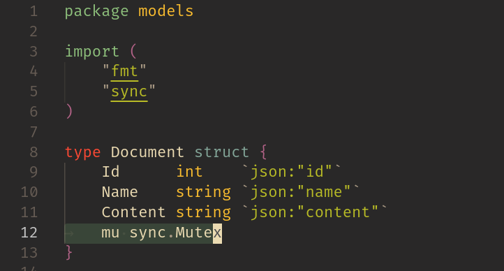
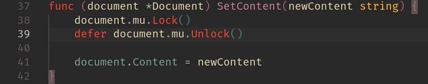

# collaborative-text-editor
Simple collaborative text editor

## Resumo

Este é um editor de texto colaborativo projetado e implementado com o intuito de demonstrar problemas e nuances de programação concorrente, utilizando um servidor monolítico escrito em Go e um frontend Web Angular.

A linguagem Go possui um grande foco em programação concorrente desde sua concepção, oferecendo um modelo de concorrência baseado em **corrotinas**, chamadas de **Goroutines**, com dois mecanismos diferentes de sincronização:

1. CSP (Communicating Sequential Processes), no qual as corrotinas não compartilham dados mutáveis e realizam a sincronização por meio de canais de comunicação de dados concurrent-safe, chamado de **Channels**, uma estrutura de dados parecida com Unix Pipes, porém com mais flexibilidade.
2. Sincronização por travas de exclusão mútua (**mutext locks**) e variáveis atômicas, para garantir a manipulação consistente de dados mutáveis compartilhados entre corrotinas. Este modelo é implementado no pacote **sync** e **sync/atomic**.

## Tratamento de concorrência

O framework de aplicações Web escolhido para o backend foi o **Fiber**. Tal framework é na verdade uma camada de abstração a partir da implementação do protocolo HTTP em Go chamada **FastHTTP** que, assim como a implementação padrão do HTTP, o pacote **net/http**, cria uma nova corrotina quando uma requisição HTTP é recebida.

A documentação oficial da linguagem Go encoraja o uso de **Channels** para sincronização entre corrotinas quando possível, descrevendo o pacote **sync** como direcionado para bibliotecas de mais baixo nível, com exceção das estruturas de dados **sync.Once** e **sync.WaitGroup**.

"Do not communicate by sharing memory; instead, share memory by communicating."
Retirado da [documentação](https://go.dev/doc/effective_go#concurrency) do Go.

Entretanto, devido a natureza do problema em questão, a implementação de um editor de texto colaborativo que compartilha objetos de texto com múltiplos usuários, foi decidido o uso do mecanismo de sincronização utilizando travas de exclusão mútua (**sync.Mutex**), demonstrado nos exemplos abaixo, retirados do código para estrutura de dados *Document*.

**Observação**: A convenção em Go para o uso de travas de exclusão mútua é chamar o método *Unlock()* precedido da palavra reservada *defer* logo após a chamada do método *Lock()*, uma vez que tal palavra reservada indica uma chamada de método/função que deve ser sempre executada após o retorno da função/método em execução no momento, visando garantir que a trava sempre seja liberada.